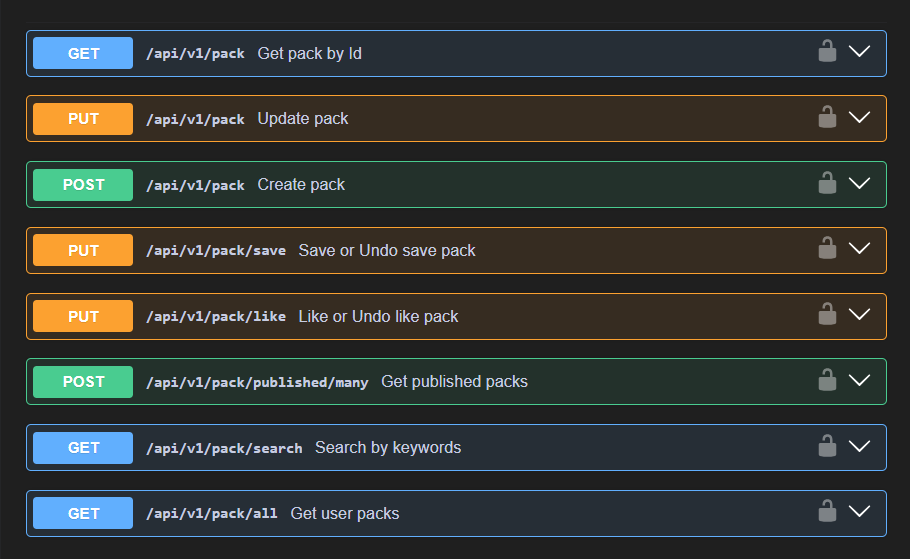
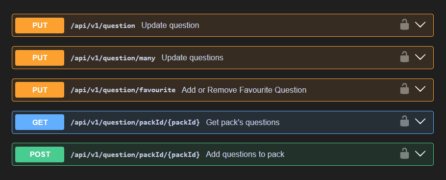
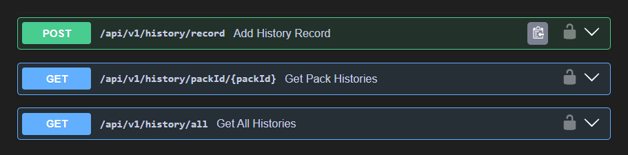
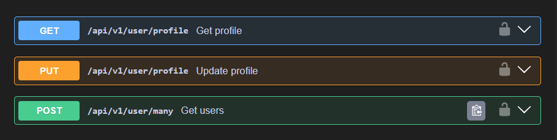
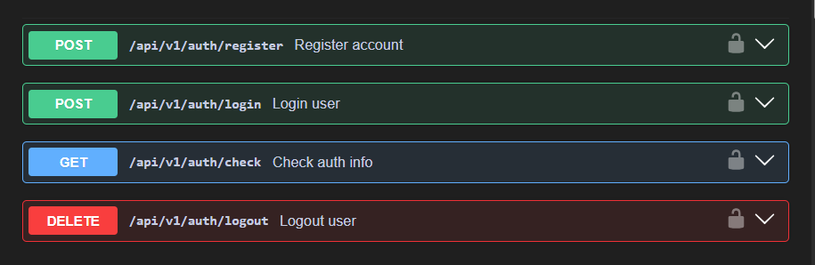
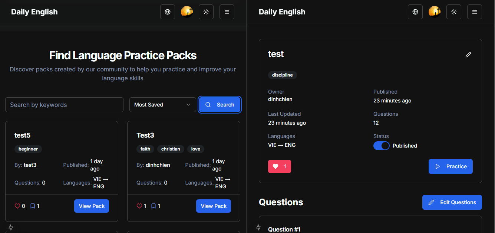
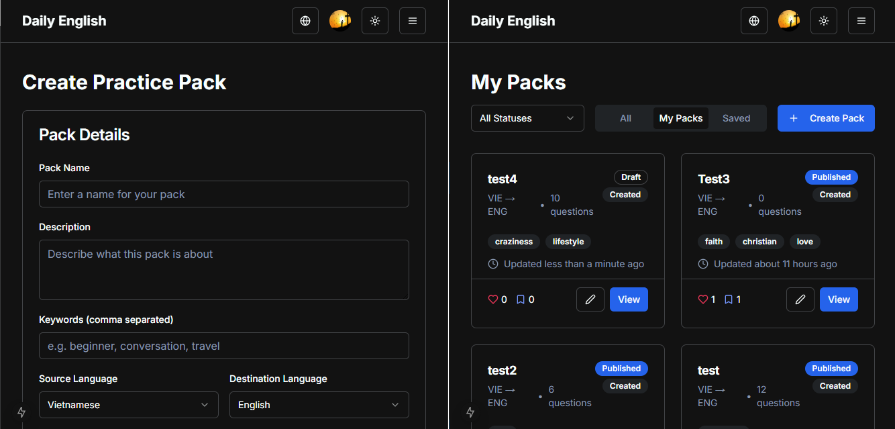
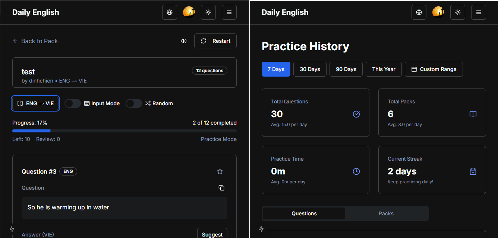

# LangPractice

This project is my attempt to build a scalable and efficient server using **Java** and the **Spring Boot Framework**. With experience gathered from previous projects, I was able to better leverage modern technologies to build this application from the ground up, focusing on core features and maintainable architecture.

---

## 📚 About LangPractice

**LangPractice** is tailored for daily language practice, built around my own learning method:

- **Create Packs**: Users create packs with custom content, each containing a list of questions (with question and answer texts).
- **Play a Pack**: For each question, users practice translating the text, combining reading, speaking, and writing exercises.
- **Track Progress**: After completing a pack, a history record is added to help users monitor their learning progress over time.
- **Pack Sharing**: Users can publish their packs so that others can learn from them.

## ✨ Highlights

- **Framework**: Spring Boot, Java
- **Database**: PostgreSQL (Full-text Search, JSONB columns)
- **ORM & Migration**: Hibernate (Data Projection, Custom Queries, L2 Cache), Flyway
- **Authentication**: Spring Security with JWT Authentication
- **API Documentation**: Swagger

---

## 📋 API Endpoints

- **Packs**  
   
- **Questions**  
   
- **Histories**  
   
- **Users**  
   
- **Auths**  
   

---

## 🌐 Frontend

The frontend app is built with **Next.js**, with efforts to offer offline experience.

👉 Try it out here: [LangPractice Web App](https://langpractice.vercel.app)

- **Search**  
   

- **Manage packs**  
   

- **Play & History**  
   

- **.etc** 

---

## 🚀 What's Next?

I am currently looking for a **Backend Developer** position because I truly want to work on large-scale projects where I can learn, grow, and contribute meaningfully.

If you know of any opportunities, please feel free to reach out — I would truly appreciate it!

---

Thanks for visiting my project! 🙌
